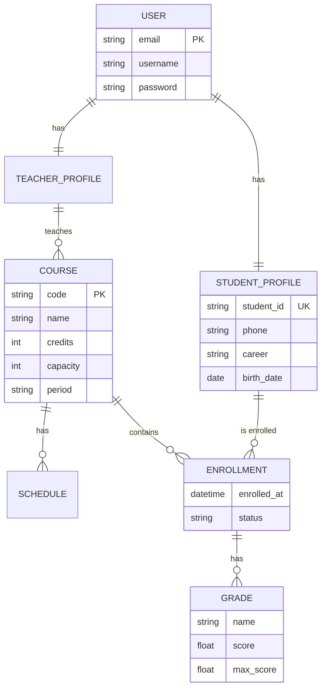

# Manual Técnico - Arquitectura y Programación

Este documento está dirigido a desarrolladores y administradores que necesiten realizar mantenimiento, escalabilidad o despliegue del sistema **EDU+ Corp**.

---

## 1. Arquitectura del Sistema
El sistema utiliza una arquitectura desacoplada donde el backend actúa como una API RESTful y el frontend consume estos recursos mediante peticiones asíncronas.

### 1.1. Tecnologías Core
- **Lenguaje**: Python 3.12 (Tipado dinámico con soporte de Type Hints en modelos).
- **Framework**: Django 5.0 + Django Rest Framework (DRF).
- **Autenticación**: JSON Web Tokens (JWT) mediante `djangorestframework-simplejwt`.
- **Frontend**: Single Page Application (SPA) conceptual en Vanilla JavaScript y CSS modulares.

---

## 2. Modelo de la Base de Datos
La base de datos se basa en una estructura relacional gestionada por el ORM de Django.

### 2.1. Diagrama de Entidad-Relación (Mermaid)


### 2.2. Implementación Detallada de Modelos
Los modelos principales definen la lógica de integridad y las relaciones entre entidades.

```python
# accounts/models.py
class User(AbstractUser):
    """Extensión del usuario base para usar email como identificador."""
    email = models.EmailField(unique=True)
    USERNAME_FIELD = "email"
    REQUIRED_FIELDS = ["username", "first_name", "last_name"]

# academic/models.py
class Course(models.Model):
    """Entidad central que representa una asignatura."""
    code = models.CharField(max_length=15, unique=True, verbose_name="Código")
    name = models.CharField(max_length=200, verbose_name="Nombre")
    credits = models.PositiveIntegerField(default=3)
    teacher = models.ForeignKey(Teacher, on_delete=models.SET_NULL, null=True, related_name="courses")
    capacity = models.PositiveIntegerField(default=30)
    is_active = models.BooleanField(default=True)

class Schedule(models.Model):
    """Horarios vinculados a un curso específico."""
    course = models.ForeignKey(Course, on_delete=models.CASCADE, related_name="schedules")
    day = models.CharField(max_length=3, choices=DAY_CHOICES)
    start_time = models.TimeField()
    end_time = models.TimeField()
    classroom = models.CharField(max_length=50)
```

---

## 3. Lógica del Backend (API y Serialización)
La capa de serialización se encarga de transformar los modelos complejos en JSON para el frontend, incluyendo campos calculados en tiempo real.

### 3.1. Serialización Compleja
Se utilizan `SerializerMethodField` para calcular vacantes y promedios dinámicamente:

```python
# academic/serializers.py
class CourseSerializer(serializers.ModelSerializer):
    enrolled_count = serializers.SerializerMethodField()
    available_slots = serializers.SerializerMethodField()

    def get_enrolled_count(self, obj):
        return obj.enrollments.filter(status="ACTIVE").count()

    def get_available_slots(self, obj):
        active = self.get_enrolled_count(obj)
        return max(obj.capacity - active, 0)
```

### 3.2. Registro de Usuarios (Proceso Atómico)
El registro crea dos registros en la base de datos de manera coordinada:

```python
# accounts/serializers.py
def create(self, validated_data):
    user = User.objects.create_user(
        username=validated_data["email"],
        email=validated_data["email"],
        password=validated_data["password"],
        first_name=validated_data.get("first_name", ""),
        last_name=validated_data.get("last_name", ""),
    )
    student = StudentProfile.objects.create(
        user=user,
        student_id=validated_data["student_id"],
        career=validated_data.get("career", ""),
    )
    return student
```

---

## 4. Lógica del Frontend (Consumo de API)
El frontend utiliza JavaScript puro para gestionar la persistencia de la sesión y las peticiones protegidas.

### 4.1. Gestión de Sesión y Refresh Token
Para evitar que el usuario cierre sesión constantemente, se implementó un mecanismo de refresco automático:

```javascript
async function refreshToken() {
  var refresh = getRefresh(); // Obtiene token de localStorage
  var res = await fetch(API_BASE + '/auth/token/refresh/', {
    method: 'POST',
    headers: { 'Content-Type': 'application/json' },
    body: JSON.stringify({ refresh: refresh })
  });
  if (!res.ok) return false;
  var data = await res.json();
  localStorage.setItem('eduplus_access', data.access);
  return true;
}
```

### 4.2. Renderizado Dinámico del Portal
El portal se carga por partes (lazy load) para mejorar el rendimiento percibido:

```javascript
async function loadAll() {
  try {
    var me = await Auth.get('/auth/me/');
    renderProfile(me); // Actualiza la UI con datos del usuario
  } catch (e) {
    window.location.replace('index.html'); // Redirige si la sesión es nula
  }
}
```

---

## 5. Configuración del Servidor y Entorno
El archivo `settings.py` define los parámetros críticos de seguridad y rendimiento.

### 5.1. Seguridad JWT y CORS
```python
REST_FRAMEWORK = {
    'DEFAULT_AUTHENTICATION_CLASSES': [
        'rest_framework_simplejwt.authentication.JWTAuthentication',
    ],
    'DEFAULT_PERMISSION_CLASSES': [
        'rest_framework.permissions.IsAuthenticated',
    ]
}
```

### 5.2. Automatización del Despliegue
El script `autodeploy.sh` automatiza 12 tareas críticas, destacando:
- **Collectstatic**: Recopila archivos del frontend para ser servidos por Nginx de forma eficiente.
- **Systemd Unit**: Genera archivos de servicio para que el backend se inicie solo tras un reinicio del servidor.

---

## 6. Mantenimiento y Escalabilidad
- **Base de Datos**: Para migrar a PostgreSQL en el futuro, solo se debe cambiar el diccionario `DATABASES` en `settings.py`.
- **Nuevos Módulos**: Cada nueva aplicación debe seguir la estructura de carpetas `apps/nombre_app/` y registrarse en `INSTALLED_APPS`.
- **Logs Críticos**: Supervisar `backend/staticfiles/` para asegurar que los cambios de diseño en CSS se reflejen en producción.

---
© 2026 Sistema diseñado para EDU+ Corp. Código fuente optimizado y documentado.


